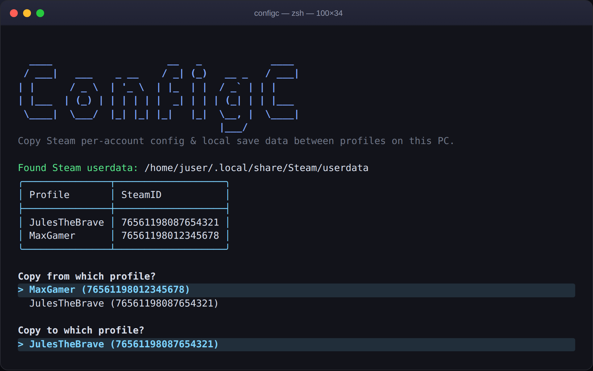
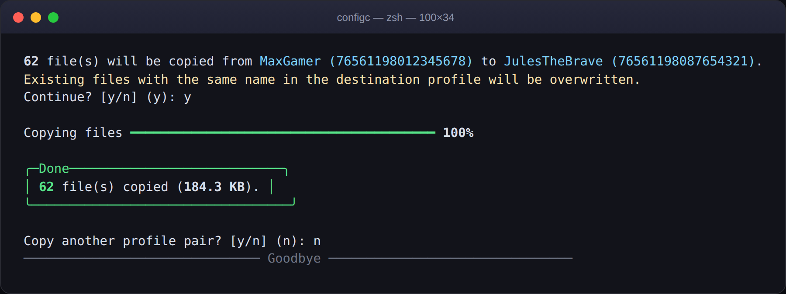
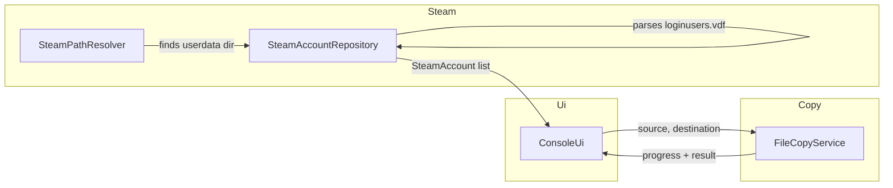

<div align="center">

# ConfigC

**Copy a Steam profile's local config & save data to another profile on the same PC — in one guided run.**

[](https://github.com/paploooov/ConfigC/actions/workflows/build.yml)
[](https://github.com/paploooov/ConfigC/actions/workflows/release.yml)
[](https://dotnet.microsoft.com/)
[](LICENSE)

</div>

## What is this for?

Steam keeps per-account settings and local (non-cloud) save data in
`Steam/userdata/<SteamID>/…` — one folder per profile that has logged in on
the machine. If you play on more than one Steam account on the same PC (a
second account, a family member's login, a fresh account after a migration),
that data does **not** follow you automatically: every game re-asks for
resolution, keybinds, and sometimes local saves all over again.

**ConfigC** walks you through picking a *source* and a *destination* profile
and copies the whole `userdata` folder for you — safely, with a progress bar
and a summary of what happened.

> This was the author's first real C# project. This update keeps the
> original idea intact and rebuilds everything around it: a safer copy
> engine, cross-platform Steam detection, readable account names instead of
> raw SteamIDs, and a proper terminal UI.

## Features

- 🔍 **Auto-detects Steam** on Windows, Linux and macOS (registry on Windows;
  the usual native and Flatpak install locations on Linux; the default
  Application Support path on macOS) — falls back to asking for a path if it
  can't find one.
- 🙋 **Shows real profile names**, not just SteamID64 numbers, by reading
  Steam's own `loginusers.vdf` (falls back gracefully if that file isn't
  available).
- ✅ **Confirms before touching anything**, shows how many files will be
  copied first, and reports exactly what happened afterwards — including any
  files that failed to copy, instead of silently stopping like the original
  version did.
- 📊 **Live progress bar** for the copy itself, powered by
  [Spectre.Console](https://spectreconsole.net/).
- 🔁 **Copy multiple profile pairs** in one session, or quit cleanly at any
  point — no more Ctrl+C required.

## Screenshots

<p align="center">
  
  <br><br>
  
</p>

## Architecture

The original was a single 85-line `Program.cs`. It's now split into small,
independently testable pieces:



| Namespace     | Responsibility                                                        |
| ------------- | ---------------------------------------------------------------------- |
| `ConfigC.Steam` | Locate the local Steam install and list its profiles with display names |
| `ConfigC.Copy`  | Recursive, resilient file copy with per-file progress reporting        |
| `ConfigC.Ui`    | The interactive Spectre.Console-based terminal flow                    |

## Getting started

### Run from source

```bash
git clone https://github.com/paploooov/ConfigC.git
cd ConfigC
dotnet run --project ConfigC
```

Requires the [.NET 8 SDK](https://dotnet.microsoft.com/download).

### Download a build

Every tagged release publishes self-contained, single-file binaries for
Windows, Linux and macOS — see the [Releases](https://github.com/paploooov/ConfigC/releases)
page. No .NET install required on the target machine.

## How it works

1. ConfigC looks for your Steam installation automatically. If it can't be
   found, you'll be asked for the path to your `userdata` folder.
2. Every profile found under `userdata` is listed, with its persona name
   when it can be resolved.
3. Pick a source and a destination profile.
4. Review the file count, confirm, and watch the progress bar.
5. Get a summary — including anything that couldn't be copied — and either
   copy another pair or quit.

## Contributing

Issues and pull requests are welcome. Before submitting a change, please run:

```bash
dotnet format
dotnet build
```

## License

Released under the [MIT License](LICENSE).
